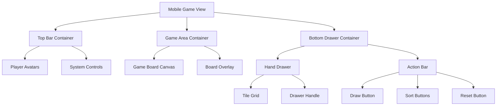

# Design Document: Mobile UI System

## Overview

The J_kube Mobile UI System transforms the complete desktop Rummikub experience into a touch-optimized mobile interface covering the entire user journey: login, lobby, game creation, and gameplay. The system provides a cohesive mobile experience with adaptive layouts, touch-friendly interactions, and optimized navigation flows.

The design employs different orientation strategies per screen: portrait for login and lobby screens (natural mobile usage), and landscape for game creation and gameplay (optimal for board games). Each screen is optimized for its specific use case while maintaining visual consistency and smooth transitions between different interface modes.

## Architecture

### System Architecture

```mermaid
graph TB
    subgraph "Mobile UI System"
        MobileApp[Mobile App Controller]
        
        subgraph "Screen Components"
            LoginScreen[Login Screen Component]
            LobbyScreen[Lobby Screen Component]
            GameCreationScreen[Game Creation Screen Component]
            GameScreen[Game Screen Component]
        end
        
        subgraph "Game Screen Components"
            HandDrawer[Hand Drawer Component]
            GameBoard[Game Board Component]
            PlayerAvatars[Player Avatar Component]
            ActionControls[Action Controls Component]
        end
        
        subgraph "Shared UI Components"
            Navigation[Navigation Component]
            Modals[Modal System]
            Notifications[Notification System]
            LoadingStates[Loading States]
        end
        
        subgraph "Interaction Layer"
            TouchManager[Touch Manager]
            GestureRecognizer[Gesture Recognizer]
            AnimationEngine[Animation Engine]
            OrientationManager[Orientation Manager]
        end
        
        subgraph "Layout System"
            ResponsiveLayout[Responsive Layout Manager]
            SafeAreaHandler[Safe Area Handler]
            ScreenTransitions[Screen Transitions]
        end
    end
    
    subgraph "Existing Game System"
        GameLogic[Game Logic Engine]
        StateManager[Game State Manager]
        NetworkLayer[Network Layer]
        AuthSystem[Authentication System]
    end
    
    MobileApp --> LoginScreen
    MobileApp --> LobbyScreen
    MobileApp --> GameCreationScreen
    MobileApp --> GameScreen
    
    GameScreen --> HandDrawer
    GameScreen --> GameBoard
    GameScreen --> PlayerAvatars
    GameScreen --> ActionControls
    
    LoginScreen --> Navigation
    LobbyScreen --> Navigation
    GameCreationScreen --> Navigation
    GameScreen --> Navigation
    
    Navigation --> TouchManager
    HandDrawer --> TouchManager
    GameBoard --> TouchManager
    
    TouchManager --> GestureRecognizer
    TouchManager --> AnimationEngine
    TouchManager --> OrientationManager
    
    MobileApp --> ResponsiveLayout
    ResponsiveLayout --> SafeAreaHandler
    ResponsiveLayout --> ScreenTransitions
    
    MobileApp --> GameLogic
    MobileApp --> StateManager
    MobileApp --> NetworkLayer
    MobileApp --> AuthSystem
```



### Component Hierarchy



## Components and Interfaces

### Screen-Specific Components

#### Login Screen Component

The Login Screen provides a mobile-optimized authentication interface in portrait orientation.

**Interface:**
```typescript
interface LoginScreenComponent {
  // State Management
  isLoading: boolean;
  errorMessage: string | null;
  
  // Authentication Methods
  login(username: string, password: string): Promise<void>;
  signup(userData: SignupData): Promise<void>;
  forgotPassword(email: string): Promise<void>;
  
  // UI Methods
  showError(message: string): void;
  clearError(): void;
  togglePasswordVisibility(): void;
  
  // Navigation
  navigateToLobby(): void;
  navigateToSignup(): void;
}
```

**Design Features:**
- **Portrait Orientation**: Natural mobile login experience
- **Large Touch Targets**: Minimum 48px height for input fields and buttons
- **Visual Feedback**: Loading states, error messages, success animations
- **Keyboard Optimization**: Proper input types, auto-focus, submit handling
- **Accessibility**: Screen reader support, high contrast mode

#### Lobby Screen Component

The Lobby Screen displays available games and social features in portrait orientation.

**Interface:**
```typescript
interface LobbyScreenComponent {
  // State Management
  availableGames: GameListing[];
  onlinePlayers: Player[];
  invitations: Invitation[];
  
  // Game Management
  refreshGameList(): Promise<void>;
  joinGame(gameId: string): Promise<void>;
  createNewGame(): void;
  
  // Social Features
  viewPlayerProfile(playerId: string): void;
  sendInvitation(playerId: string): Promise<void>;
  acceptInvitation(invitationId: string): Promise<void>;
  
  // Navigation
  navigateToGameCreation(): void;
  navigateToGame(gameId: string): void;
  logout(): void;
}
```

**Design Features:**
- **Card-Based Layout**: Game listings as swipeable cards
- **Pull-to-Refresh**: Native mobile refresh pattern
- **Floating Action Button**: Prominent "Create Game" button
- **Tab Navigation**: Games, Players, Invitations tabs
- **Real-time Updates**: Live game status and player presence

#### Game Creation Screen Component

The Game Creation Screen provides game setup in landscape orientation for better form layout.

**Interface:**
```typescript
interface GameCreationScreenComponent {
  // Game Configuration
  gameSettings: GameSettings;
  invitedPlayers: Player[];
  
  // Configuration Methods
  updateGameSettings(settings: Partial<GameSettings>): void;
  addPlayer(player: Player): void;
  removePlayer(playerId: string): void;
  toggleBotPlayer(slot: number): void;
  
  // Game Management
  createGame(): Promise<void>;
  startGame(): Promise<void>;
  cancelCreation(): void;
  
  // Navigation
  navigateToLobby(): void;
  navigateToGame(): void;
}
```

**Design Features:**
- **Landscape Orientation**: Better space for form controls and player list
- **Step-by-Step Flow**: Progressive disclosure of options
- **Player Management**: Visual player slots with add/remove controls
- **Settings Panels**: Collapsible sections for advanced options
- **Preview Mode**: Show game setup summary before creation

#### Game Screen Component (Enhanced)

The Game Screen provides the core gameplay experience in landscape orientation with the sliding drawer system.

**Interface:**
```typescript
interface GameScreenComponent {
  // Game State
  gameState: GameState;
  currentPlayer: Player;
  isMyTurn: boolean;
  
  // Sub-Components
  handDrawer: HandDrawerComponent;
  gameBoard: GameBoardComponent;
  playerAvatars: PlayerAvatarComponent[];
  actionControls: ActionControlsComponent;
  
  // Game Actions
  placeTiles(tiles: Tile[], position: BoardPosition): Promise<void>;
  drawTile(): Promise<void>;
  endTurn(): Promise<void>;
  
  // UI Management
  showGameMenu(): void;
  exitGame(): void;
  
  // Navigation
  navigateToLobby(): void;
}
```

**Design Features:**
- **Landscape Orientation**: Optimal for board game layout
- **Sliding Hand Drawer**: Space-efficient tile management
- **Smart Board Positioning**: Automatic view optimization
- **Compact Player Avatars**: Efficient multiplayer display
- **Gesture Controls**: Touch-optimized interactions

### Shared UI Components

#### Navigation Component

Provides consistent navigation patterns across all screens with adaptive behavior.

**Interface:**
```typescript
interface NavigationComponent {
  // Navigation State
  currentScreen: ScreenType;
  navigationHistory: ScreenType[];
  canGoBack: boolean;
  
  // Navigation Methods
  navigateTo(screen: ScreenType, params?: any): void;
  goBack(): void;
  resetToScreen(screen: ScreenType): void;
  
  // UI Methods
  showBackButton(): void;
  hideBackButton(): void;
  setTitle(title: string): void;
  
  // Screen Transitions
  slideTransition(direction: 'left' | 'right'): Promise<void>;
  fadeTransition(): Promise<void>;
  orientationTransition(): Promise<void>;
}
```

#### Modal System Component

Handles overlays, dialogs, and popup interfaces across all screens.

**Interface:**
```typescript
interface ModalSystemComponent {
  // Modal Management
  activeModals: Modal[];
  
  // Modal Methods
  showModal(config: ModalConfig): Promise<any>;
  hideModal(modalId: string): void;
  hideAllModals(): void;
  
  // Predefined Modals
  showConfirmDialog(message: string): Promise<boolean>;
  showErrorDialog(error: string): Promise<void>;
  showLoadingModal(message: string): void;
  showPlayerProfile(player: Player): void;
}
```

#### Orientation Manager

Manages screen orientation changes and transitions between portrait/landscape modes.

**Interface:**
```typescript
interface OrientationManagerComponent {
  // Orientation State
  currentOrientation: 'portrait' | 'landscape';
  targetOrientation: 'portrait' | 'landscape' | 'auto';
  
  // Orientation Control
  lockOrientation(orientation: 'portrait' | 'landscape'): void;
  unlockOrientation(): void;
  
  // Transition Management
  handleOrientationChange(newOrientation: string): Promise<void>;
  animateOrientationTransition(): Promise<void>;
  
  // Screen-Specific Rules
  getRequiredOrientation(screen: ScreenType): 'portrait' | 'landscape';
}
```

The Hand Drawer is the centerpiece of the mobile interface, providing an elegant solution for tile management on small screens.

**Interface:**
```typescript
interface HandDrawerComponent {
  // State Management
  isExpanded: boolean;
  tiles: GameTile[];
  selectedTiles: GameTile[];
  
  // Core Methods
  expand(): Promise<void>;
  collapse(): Promise<void>;
  toggle(): Promise<void>;
  
  // Tile Management
  addTile(tile: GameTile): void;
  removeTile(tileId: string): void;
  selectTile(tileId: string): void;
  deselectTile(tileId: string): void;
  clearSelection(): void;
  
  // Sorting and Organization
  sortByColor(): void;
  sortByNumber(): void;
  shuffleTiles(): void;
  
  // Animation Control
  animateExpansion(duration: number): Promise<void>;
  animateCollapse(duration: number): Promise<void>;
}
```

**Behavior:**
- **Collapsed State**: Shows only top 20px with subtle gradient and handle indicator
- **Expanded State**: Slides up to reveal full tile collection (60% of screen height)
- **Auto-collapse**: Triggers after tile placement or drag-out actions
- **Touch Zones**: Handle area for expansion, tile area for selection
- **Animation**: Smooth 300ms ease-out transitions

### Game Board Component

The Game Board provides intelligent positioning and touch-optimized tile placement.

**Interface:**
```typescript
interface GameBoardComponent {
  // View Management
  centerPosition: Point2D;
  zoomLevel: number;
  viewBounds: Rectangle;
  
  // Positioning Methods
  centerOnTiles(tiles: GameTile[]): Promise<void>;
  centerOnPlayer(playerId: string): Promise<void>;
  resetToDefaultView(): Promise<void>;
  
  // Tile Placement
  getValidPlacementAreas(tiles: GameTile[]): PlacementArea[];
  placeTiles(tiles: GameTile[], position: Point2D): boolean;
  validatePlacement(tiles: GameTile[], position: Point2D): boolean;
  
  // Visual Feedback
  highlightValidAreas(areas: PlacementArea[]): void;
  showPlacementPreview(tiles: GameTile[], position: Point2D): void;
  clearHighlights(): void;
}
```

**Smart Positioning Logic:**
- **New Placement**: Auto-center on newly placed tiles
- **Turn Start**: Focus on areas relevant to current player
- **Board Growth**: Maintain optimal zoom for tile visibility
- **Manual Override**: Respect user positioning until next auto-event

### Player Avatar Component

Compact representation of players with turn indication and status display.

**Interface:**
```typescript
interface PlayerAvatarComponent {
  // Player Data
  playerId: string;
  playerName: string;
  initial: string;
  isCurrentTurn: boolean;
  isConnected: boolean;
  tileCount: number;
  
  // Visual States
  showTurnIndicator(): void;
  hideTurnIndicator(): void;
  setConnectionStatus(connected: boolean): void;
  
  // Interaction
  onTap(): void;
  showPlayerDetails(): void;
  hidePlayerDetails(): void;
}
```

**Visual Design:**
- **Size**: 48px diameter circles
- **Content**: Single letter initial, colored background
- **Turn Indicator**: Animated glowing ring (2px, pulsing)
- **Status**: Subtle opacity change for disconnected players
- **Positioning**: Evenly distributed across top edge

### Touch Manager

Centralized touch event handling with gesture recognition and conflict resolution.

**Interface:**
```typescript
interface TouchManager {
  // Event Registration
  registerTouchTarget(element: HTMLElement, handlers: TouchHandlers): void;
  unregisterTouchTarget(element: HTMLElement): void;
  
  // Gesture Recognition
  recognizeTap(event: TouchEvent): TapGesture | null;
  recognizeDrag(event: TouchEvent): DragGesture | null;
  recognizePinch(event: TouchEvent): PinchGesture | null;
  
  // Conflict Resolution
  resolveTouchConflicts(gestures: Gesture[]): Gesture[];
  preventAccidentalTouches(event: TouchEvent): boolean;
}
```

## Data Models

### Screen Configuration Models

```typescript
interface ScreenConfig {
  screenType: 'login' | 'lobby' | 'game-creation' | 'game';
  orientation: 'portrait' | 'landscape';
  allowOrientationChange: boolean;
  navigationStyle: 'none' | 'back' | 'tabs' | 'drawer';
  statusBarStyle: 'light' | 'dark' | 'auto';
}

interface ScreenTransition {
  fromScreen: ScreenType;
  toScreen: ScreenType;
  transitionType: 'slide' | 'fade' | 'orientation-change';
  duration: number;
  easing: EasingFunction;
}
```

### Mobile Layout Configuration

```typescript
interface MobileLayoutConfig {
  // Screen-specific configurations
  screens: {
    login: {
      orientation: 'portrait';
      safeAreas: SafeAreaConfig;
      layout: PortraitLayoutConfig;
    };
    lobby: {
      orientation: 'portrait';
      safeAreas: SafeAreaConfig;
      layout: PortraitLayoutConfig;
    };
    gameCreation: {
      orientation: 'landscape';
      safeAreas: SafeAreaConfig;
      layout: LandscapeLayoutConfig;
    };
    game: {
      orientation: 'landscape';
      safeAreas: SafeAreaConfig;
      layout: GameLayoutConfig;
    };
  };
  
  // Global settings
  breakpoints: {
    small: number;    // < 768px width
    medium: number;   // 768px - 1024px width
    large: number;    // > 1024px width
  };
  
  // Animation settings
  transitions: {
    screenChange: number;      // 300ms
    orientationChange: number; // 500ms
    drawerAnimation: number;   // 250ms
  };
}

interface GameLayoutConfig extends LandscapeLayoutConfig {
  gameAreaHeight: number;
  drawerCollapsedHeight: number;
  drawerExpandedHeight: number;
  playerAvatarSize: number;
  boardPadding: number;
}
```

### Screen-Specific State Models

```typescript
interface LoginScreenState {
  formData: {
    username: string;
    password: string;
    rememberMe: boolean;
  };
  validation: {
    usernameError?: string;
    passwordError?: string;
  };
  isLoading: boolean;
  errorMessage?: string;
}

interface LobbyScreenState {
  activeTab: 'games' | 'players' | 'invitations';
  gameListings: GameListing[];
  onlinePlayers: Player[];
  invitations: Invitation[];
  refreshing: boolean;
  lastRefresh: Date;
}

interface GameCreationState {
  step: 'settings' | 'players' | 'review';
  gameSettings: GameSettings;
  playerSlots: PlayerSlot[];
  invitedPlayers: Player[];
  isCreating: boolean;
}
```
```

### Touch Gesture Models

```typescript
interface TouchGesture {
  type: 'tap' | 'drag' | 'pinch' | 'swipe';
  startPosition: Point2D;
  currentPosition: Point2D;
  endPosition?: Point2D;
  duration: number;
  velocity?: Vector2D;
  scale?: number;
}

interface DragGesture extends TouchGesture {
  type: 'drag';
  draggedElement: HTMLElement;
  dropTarget?: HTMLElement;
  isValid: boolean;
}
```

### Animation State Models

```typescript
interface AnimationState {
  component: string;
  property: string;
  startValue: any;
  endValue: any;
  duration: number;
  easing: EasingFunction;
  progress: number;
  isComplete: boolean;
}

interface DrawerAnimationState extends AnimationState {
  component: 'hand-drawer';
  property: 'height' | 'translateY' | 'opacity';
  direction: 'expand' | 'collapse';
}
```

## Correctness Properties

*A property is a characteristic or behavior that should hold true across all valid executions of a system-essentially, a formal statement about what the system should do. Properties serve as the bridge between human-readable specifications and machine-verifiable correctness guarantees.*

### Property-Based Testing Overview

Property-based testing validates software correctness by testing universal properties across many generated inputs. Each property is a formal specification that should hold for all valid inputs.

### Core Principles

1. **Universal Quantification**: Every property must contain an explicit "for all" statement
2. **Requirements Traceability**: Each property must reference the requirements it validates
3. **Executable Specifications**: Properties must be implementable as automated tests
4. **Comprehensive Coverage**: Properties should cover all testable acceptance criteria

Now I'll analyze the acceptance criteria to determine which are testable as properties:

### Property Reflection

After analyzing all acceptance criteria, I've identified several areas where properties can be consolidated to eliminate redundancy and provide more comprehensive validation:

**Consolidation Opportunities:**
- Touch target size requirements (3.6, 6.6, 12.1) can be combined into one comprehensive property
- Animation performance requirements (2.6, 4.4, 8.1) can be unified under a single performance property
- Visual consistency requirements (10.1, 10.2, 10.3, 10.5) can be combined into design consistency properties
- Accessibility requirements (12.1, 12.2, 12.3, 12.4, 12.5) can be grouped into comprehensive accessibility properties

### Converting EARS to Properties

Based on the prework analysis, here are the key correctness properties for the mobile UI system:

**Property 1: Hand Drawer State Management**
*For any* game state and user interaction, the hand drawer should maintain consistent expand/collapse behavior based on user actions and game events
**Validates: Requirements 2.1, 2.2, 2.3, 2.4, 2.5**

**Property 2: Touch Target Accessibility**
*For all* interactive elements in the mobile interface, the touch target size should be at least 44px to ensure accessibility compliance
**Validates: Requirements 3.6, 6.6, 12.1**

**Property 3: Gesture Recognition Consistency**
*For any* touch gesture (tap, drag, pinch), the system should provide immediate visual feedback and execute the appropriate action consistently
**Validates: Requirements 3.1, 3.2, 9.1, 9.2, 9.4**

**Property 4: Smart Board Positioning**
*For any* tile placement or turn transition, the board should automatically position to show relevant game areas with smooth animations
**Validates: Requirements 4.1, 4.2, 4.3, 4.4**

**Property 5: Responsive Layout Adaptation**
*For any* mobile device screen size, the interface should adapt proportions while maintaining usability and accessibility of all elements
**Validates: Requirements 7.1, 7.2, 7.3, 7.4, 7.5**

**Property 6: Performance Consistency**
*For all* animations, transitions, and interactions, the system should maintain 60fps performance and provide feedback within 16ms
**Validates: Requirements 2.6, 4.4, 8.1, 8.5**

**Property 7: Player Avatar State Synchronization**
*For any* player state change (turn, connection, score), the avatar should update to reflect the current state with appropriate visual indicators
**Validates: Requirements 5.1, 5.2, 5.3, 5.5, 5.6**

**Property 8: Tile Management Operations**
*For any* tile sorting, selection, or placement operation, the system should maintain tile integrity and provide consistent visual feedback
**Validates: Requirements 6.2, 6.3, 6.4, 3.3, 3.4**

**Property 9: Orientation and Layout Stability**
*For any* device rotation or screen configuration change, the system should maintain landscape orientation and proper safe area handling
**Validates: Requirements 1.1, 1.2, 1.3, 1.4**

**Property 10: Game Logic Integration**
*For any* mobile UI interaction, the system should maintain full compatibility with existing game logic and desktop player interactions
**Validates: Requirements 11.1, 11.2, 11.3, 11.4, 11.5**

**Property 11: Visual Design Consistency**
*For all* UI elements, the system should maintain appropriate contrast ratios, visual hierarchy, and consistent iconography suitable for mobile viewing
**Validates: Requirements 10.1, 10.2, 10.3, 10.4, 10.5**

**Property 12: Comprehensive Accessibility**
*For any* user with accessibility needs, the system should provide screen reader support, sufficient contrast, meaningful descriptions, and alternative input methods
**Validates: Requirements 12.2, 12.3, 12.4, 12.5**

## Error Handling

### Touch Interaction Errors

**Invalid Gesture Recognition:**
- **Detection**: Monitor for gestures that don't match expected patterns
- **Response**: Ignore invalid gestures, provide subtle feedback for near-misses
- **Recovery**: Reset gesture state, allow user to retry

**Touch Conflict Resolution:**
- **Detection**: Multiple simultaneous touches on conflicting elements
- **Response**: Prioritize based on touch order and element hierarchy
- **Recovery**: Cancel conflicting gestures, maintain primary interaction

**Drag and Drop Failures:**
- **Detection**: Tiles dropped on invalid positions or outside game area
- **Response**: Animate tile return to original position with bounce effect
- **Recovery**: Restore tile to hand, clear any temporary visual states

### Performance Degradation

**Frame Rate Drops:**
- **Detection**: Monitor animation frame timing below 60fps threshold
- **Response**: Reduce animation complexity, disable non-essential effects
- **Recovery**: Restore full animations when performance improves

**Memory Pressure:**
- **Detection**: Monitor memory usage approaching device limits
- **Response**: Clear cached animations, reduce texture quality
- **Recovery**: Implement progressive enhancement as memory becomes available

**Touch Responsiveness Issues:**
- **Detection**: Touch feedback delays exceeding 16ms threshold
- **Response**: Prioritize touch handling, defer non-critical operations
- **Recovery**: Resume normal operation priority when responsiveness restored

### Layout and Orientation Errors

**Safe Area Calculation Failures:**
- **Detection**: UI elements overlapping with system UI or notches
- **Response**: Apply conservative safe area margins, adjust layout
- **Recovery**: Recalculate safe areas on orientation or viewport changes

**Responsive Breakpoint Failures:**
- **Detection**: Layout elements becoming unusable at certain screen sizes
- **Response**: Apply fallback layout with minimum viable sizing
- **Recovery**: Restore optimal layout when screen size permits

## Testing Strategy

### Dual Testing Approach

The mobile UI system requires both unit testing and property-based testing to ensure comprehensive coverage:

**Unit Tests:**
- Specific gesture recognition scenarios
- Layout calculations for known device configurations
- Animation timing and easing functions
- Touch target size validation for specific elements
- Integration points with existing game logic

**Property-Based Tests:**
- Universal gesture recognition across all possible touch patterns
- Layout adaptation across randomly generated screen dimensions
- Performance consistency across various animation scenarios
- Accessibility compliance across all UI element combinations
- State management consistency across random user interaction sequences

### Property-Based Testing Configuration

**Testing Framework:** Fast-check (JavaScript property-based testing library)
**Minimum Iterations:** 100 per property test
**Test Environment:** Mobile device simulators and real device testing
**Performance Monitoring:** Frame rate tracking, memory usage monitoring, touch latency measurement

**Property Test Tags:**
- **Feature: mobile-ui, Property 1:** Hand drawer state management consistency
- **Feature: mobile-ui, Property 2:** Touch target accessibility compliance
- **Feature: mobile-ui, Property 3:** Gesture recognition and feedback consistency
- **Feature: mobile-ui, Property 4:** Smart board positioning behavior
- **Feature: mobile-ui, Property 5:** Responsive layout adaptation
- **Feature: mobile-ui, Property 6:** Performance consistency across operations
- **Feature: mobile-ui, Property 7:** Player avatar state synchronization
- **Feature: mobile-ui, Property 8:** Tile management operation integrity
- **Feature: mobile-ui, Property 9:** Orientation and layout stability
- **Feature: mobile-ui, Property 10:** Game logic integration compatibility
- **Feature: mobile-ui, Property 11:** Visual design consistency
- **Feature: mobile-ui, Property 12:** Comprehensive accessibility support

### Mobile-Specific Testing Requirements

**Device Testing Matrix:**
- **Screen Sizes:** Small (< 768px), Medium (768-1024px), Large (> 1024px)
- **Aspect Ratios:** Standard (16:9), Wide (18:9, 19:9), Ultra-wide (21:9)
- **Performance Tiers:** Low-end (< 2GB RAM), Mid-range (2-4GB RAM), High-end (> 4GB RAM)
- **Operating Systems:** iOS Safari, Android Chrome, various WebView implementations

**Performance Benchmarks:**
- **Animation Frame Rate:** Consistent 60fps during all transitions
- **Touch Response Time:** < 16ms from touch to visual feedback
- **Memory Usage:** < 150MB peak usage on low-end devices
- **Load Time:** < 3 seconds from app launch to interactive state
- **Battery Impact:** Minimal CPU usage during idle states

**Accessibility Testing:**
- **Screen Reader Compatibility:** VoiceOver (iOS), TalkBack (Android)
- **Touch Target Validation:** Automated measurement of all interactive elements
- **Color Contrast Testing:** WCAG AA compliance verification
- **Alternative Input Testing:** Switch control, voice control compatibility