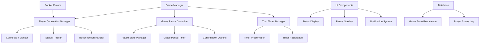

# Design Document: Player Reconnection Management

## Overview

The Player Reconnection Management system provides a seamless experience for handling temporary player disconnections in multiplayer Rummikub games. The system automatically pauses games when the current player disconnects, provides real-time status updates, and offers intelligent continuation options when players don't return within a reasonable timeframe.

Key design principles:
- **Minimize disruption**: Pause only when necessary (current player disconnects)
- **Preserve progress**: Maintain exact game state and turn timer
- **Clear communication**: Keep all players informed of status changes
- **Flexible recovery**: Provide multiple options for game continuation
- **Mobile-friendly**: Handle app backgrounding and network instability gracefully

## Architecture

### System Components



### Data Flow

1. **Disconnection Detection**: Connection Monitor detects player disconnect
2. **Status Assessment**: System determines if current player or other player
3. **Game Pause Decision**: If current player, trigger pause; otherwise, update status only
4. **State Preservation**: Save complete game state and timer information
5. **Grace Period**: Start countdown timer for reconnection window
6. **Status Broadcasting**: Notify all players of pause and status changes
7. **Reconnection Handling**: Restore state when player returns or handle timeout

## Components and Interfaces

### Player Connection Manager

**Purpose**: Tracks and manages player connection states with intelligent detection of temporary vs permanent disconnections.

**Key Methods**:
```javascript
class PlayerConnectionManager {
  // Monitor connection health and detect disconnections
  monitorConnection(playerId, connectionMetrics)
  
  // Update player status with debouncing for temporary interruptions
  updatePlayerStatus(playerId, status, reason)
  
  // Handle reconnection attempts with state restoration
  handleReconnection(playerId, gameId, preservedState)
  
  // Distinguish between different disconnection types
  classifyDisconnection(reason, duration, networkCondition)
}
```

**Connection Status States**:
- `CONNECTED`: Player actively connected and responsive
- `DISCONNECTING`: Brief interruption detected, waiting for confirmation
- `RECONNECTING`: Player attempting to reconnect within grace period
- `DISCONNECTED`: Player confirmed disconnected, grace period active
- `ABANDONED`: Grace period expired, player considered gone

### Game Pause Controller

**Purpose**: Manages game pause state, grace periods, continuation decisions, and game lifecycle.

**Key Methods**:
```javascript
class GamePauseController {
  // Pause game with specific reason and affected player
  pauseGame(gameId, reason, playerId, preservedState)
  
  // Resume game after successful reconnection
  resumeGame(gameId, playerId, restoredState)
  
  // Handle grace period expiration
  handleGracePeriodExpired(gameId, options)
  
  // Process continuation decision from remaining players
  processContinuationDecision(gameId, decision, votes)
  
  // Handle complete game abandonment (all players disconnect)
  handleGameAbandonment(gameId, reason)
  
  // Clean up and remove abandoned games from active game list
  cleanupAbandonedGame(gameId)
}
```

**Pause Reasons**:
- `CURRENT_PLAYER_DISCONNECT`: Current player lost connection during turn
- `MULTIPLE_DISCONNECTS`: Multiple players disconnected simultaneously
- `NETWORK_INSTABILITY`: Poor connection quality affecting gameplay
- `ALL_PLAYERS_DISCONNECT`: All players have disconnected (triggers game cleanup)
- `MANUAL_PAUSE`: Player-requested pause (future enhancement)

### Turn Timer Manager

**Purpose**: Handles timer preservation, restoration, and synchronization across pause/resume cycles.

**Key Methods**:
```javascript
class TurnTimerManager {
  // Preserve current timer state when pausing
  preserveTimer(gameId, playerId, remainingTime, turnStartTime)
  
  // Restore timer state when resuming
  restoreTimer(gameId, playerId, preservedTime)
  
  // Handle timer during grace period (keep paused)
  pauseTimerForGracePeriod(gameId, gracePeriodDuration)
  
  // Reset timer for next player if current player is skipped
  resetTimerForNextPlayer(gameId, nextPlayerId)
}
```

### Reconnection Handler

**Purpose**: Manages the reconnection process, state validation, and seamless game restoration.

**Key Methods**:
```javascript
class ReconnectionHandler {
  // Attempt to reconnect player to existing game
  attemptReconnection(playerId, gameId, connectionInfo)
  
  // Validate and restore player's game state
  restorePlayerState(playerId, gameId, preservedState)
  
  // Synchronize player with current game state
  synchronizeGameState(playerId, currentGameState)
  
  // Handle failed reconnection attempts
  handleReconnectionFailure(playerId, gameId, reason)
}
```

## Data Models

### Enhanced Game State

```javascript
// Extended game model to support pause/reconnection
const GameSchema = {
  // Existing fields...
  gameId: String,
  players: [PlayerSchema],
  currentPlayerIndex: Number,
  board: [[TileSchema]],
  
  // New pause/reconnection fields
  isPaused: Boolean,
  pauseReason: String,
  pausedAt: Date,
  pausedBy: String, // playerId who caused pause
  
  gracePeriod: {
    isActive: Boolean,
    startTime: Date,
    duration: Number, // milliseconds
    targetPlayerId: String
  },
  
  turnTimer: {
    remainingTime: Number, // milliseconds
    pausedAt: Date,
    originalDuration: Number
  },
  
  playerStatuses: [{
    playerId: String,
    status: String, // CONNECTED, DISCONNECTING, RECONNECTING, etc.
    lastSeen: Date,
    disconnectedAt: Date,
    reconnectionAttempts: Number
  }],
  
  continuationOptions: {
    presented: Boolean,
    presentedAt: Date,
    options: [String], // ['skip_turn', 'add_bot', 'end_game']
    votes: [{
      playerId: String,
      choice: String,
      votedAt: Date
    }]
  }
};
```

### Player Connection Metrics

```javascript
const ConnectionMetrics = {
  playerId: String,
  gameId: String,
  
  // Connection quality indicators
  latency: Number,
  packetLoss: Number,
  connectionQuality: String, // 'excellent', 'good', 'fair', 'poor'
  
  // Disconnection tracking
  disconnectionCount: Number,
  lastDisconnectReason: String,
  averageReconnectionTime: Number,
  
  // Mobile-specific metrics
  isMobile: Boolean,
  appBackgroundEvents: Number,
  networkType: String, // 'wifi', 'cellular', 'unknown'
  
  // Timestamps
  sessionStartTime: Date,
  lastActivityTime: Date,
  totalSessionTime: Number
};
```

## Correctness Properties

*A property is a characteristic or behavior that should hold true across all valid executions of a system-essentially, a formal statement about what the system should do. Properties serve as the bridge between human-readable specifications and machine-verifiable correctness guarantees.*

<function_calls>
<invoke name="prework">
<parameter name="featureName">player-reconnection-management

Based on the prework analysis, I'll now convert the testable acceptance criteria into formal correctness properties. After reviewing all properties for redundancy, I can consolidate several related properties:

**Property Consolidation**:
- Properties 1.2 and 5.1 both test timer preservation during disconnection → Combine into Property 1
- Properties 3.5 and 4.1 both test grace period expiration handling → Combine into Property 2  
- Properties 2.1, 2.2, 2.4, 2.5 all test status management → Combine into Property 3
- Properties 8.1, 8.2, 8.3 all test state persistence → Combine into Property 4

### Property 1: Timer Preservation and Restoration
*For any* game where a current player disconnects during their turn, pausing the game should preserve the exact remaining turn time, and reconnecting should restore that exact time
**Validates: Requirements 1.2, 5.1, 5.2**

### Property 2: Grace Period Management  
*For any* current player disconnection, the system should start a 180-second grace period, and if it expires without reconnection, continuation options should be presented to remaining players
**Validates: Requirements 3.1, 3.5, 4.1**

### Property 3: Real-time Status Updates
*For any* player connection status change, all other players should immediately see the updated status with appropriate visual indicators and notifications
**Validates: Requirements 2.1, 2.2, 2.4, 2.5**

### Property 4: Complete State Persistence Round-trip
*For any* game state when a player disconnects, saving then restoring should produce an equivalent game state including hand tiles, board position, and turn progress
**Validates: Requirements 8.1, 8.2, 8.3**

### Property 5: Current Player Pause Behavior
*For any* game where the current player disconnects, the game should pause immediately and prevent all game actions until reconnection or grace period expiration
**Validates: Requirements 1.1, 1.4**

### Property 6: Non-current Player Continuation
*For any* game where a non-current player disconnects, the game should continue normally while marking that player as disconnected
**Validates: Requirements 1.5**

### Property 7: Notification Broadcasting
*For any* pause, reconnection, or continuation event, all remaining players should receive appropriate notifications with complete information
**Validates: Requirements 1.3, 6.3, 9.1, 9.2, 9.5**

### Property 8: Grace Period UI Display
*For any* active grace period, all players should see a countdown timer with clear formatting and periodic updates
**Validates: Requirements 3.2, 6.4, 9.3**

### Property 9: Continuation Options Completeness
*For any* grace period expiration, the system should present exactly three options ("Skip Turn", "Add Bot Player", "End Game") with clear descriptions
**Validates: Requirements 4.2, 6.5, 9.4**

### Property 10: Continuation Decision Processing
*For any* continuation decision (skip turn, add bot, or end game), the system should execute the chosen action correctly and inform all players
**Validates: Requirements 4.3, 4.4, 4.5**

### Property 11: Mobile Interruption Handling
*For any* mobile app backgrounding event under 10 seconds, the system should treat it as temporary and not trigger disconnection procedures
**Validates: Requirements 7.1**

### Property 12: Disconnection Detection Timing
*For any* potential disconnection event, the system should wait exactly 3 seconds before marking the player as disconnected
**Validates: Requirements 2.3, 7.2**

### Property 13: Adaptive Grace Periods
*For any* player with unstable connection quality, the system should provide an extended grace period of 300 seconds instead of the standard 180 seconds
**Validates: Requirements 7.3**

### Property 14: Concurrent Disconnection Independence
*For any* scenario where multiple players disconnect simultaneously, each disconnection should be handled independently without interference
**Validates: Requirements 7.4**

### Property 15: Timer Behavior During Grace Period
*For any* active grace period, the turn timer should remain paused regardless of grace period countdown progress
**Validates: Requirements 5.3**

### Property 16: Timer Reset on Skip Turn
*For any* disconnected player whose turn is skipped, the turn timer should reset to full duration for the next player
**Validates: Requirements 5.4**

### Property 17: Bot Replacement Timer Continuation
*For any* disconnected player replaced by a bot, the turn timer should continue with the preserved remaining time
**Validates: Requirements 5.5**

### Property 18: Data Integrity Validation
*For any* game state restoration, the system should verify data integrity before resuming and provide fallback options if validation fails
**Validates: Requirements 8.4, 8.5**

### Property 19: Connection Quality Warnings
*For any* player experiencing poor network conditions, the system should provide proactive connection quality warnings
**Validates: Requirements 7.5**

### Property 20: Comprehensive Event Logging
*For any* disconnection, reconnection, or pause event, the system should log complete information including timestamp, player, reason, and relevant metrics
**Validates: Requirements 10.1, 10.2, 10.3, 10.4, 10.5**

### Property 21: Game Cleanup on Total Abandonment
*For any* game where all players disconnect and no reconnections occur within grace periods, the system should remove the game from the active games list and clean up all associated resources
**Validates: Requirements 10.4 (game lifecycle management)**

## Error Handling

### Disconnection Detection Errors
- **False Positive Detection**: Implement 3-second confirmation delay to avoid marking temporary network hiccups as disconnections
- **Mobile App Backgrounding**: Distinguish between app backgrounding (< 10 seconds) and actual disconnection
- **Network Quality Assessment**: Monitor connection metrics to provide appropriate grace periods

### State Persistence Failures
- **Database Unavailable**: Cache state locally and retry persistence with exponential backoff
- **Corrupted State Data**: Validate state integrity on restoration and provide fallback options
- **Partial State Loss**: Implement incremental state saving to minimize data loss

### Grace Period Management Errors
- **Timer Synchronization**: Ensure grace period timers are synchronized across all clients
- **Concurrent Expirations**: Handle multiple grace periods expiring simultaneously
- **Clock Drift**: Use server-side authoritative timing for grace period management

### Reconnection Failures
- **Authentication Issues**: Re-authenticate players on reconnection attempts
- **Game State Mismatch**: Detect and resolve state conflicts between client and server
- **Connection Timeout**: Provide clear feedback when reconnection attempts fail

### UI Consistency Errors
- **Status Update Delays**: Implement optimistic UI updates with rollback on failure
- **Notification Delivery**: Ensure all players receive critical notifications with retry logic
- **Visual Indicator Sync**: Keep connection status indicators synchronized across all clients

## Testing Strategy

### Dual Testing Approach
The system requires both unit testing and property-based testing for comprehensive coverage:

**Unit Tests**: Focus on specific scenarios, edge cases, and error conditions
- Specific disconnection scenarios (network timeout, app crash, manual disconnect)
- Grace period boundary conditions (exactly at expiration, just before/after)
- State restoration edge cases (corrupted data, missing fields, version mismatches)
- UI component behavior (status indicators, notifications, overlays)

**Property-Based Tests**: Verify universal properties across all possible inputs
- Generate random game states and verify pause/resume behavior
- Test timer preservation accuracy across various time values
- Validate state persistence round-trips with randomized game data
- Verify notification delivery across different player configurations

### Property-Based Testing Configuration
- **Framework**: Use fast-check for JavaScript property-based testing
- **Iterations**: Minimum 100 iterations per property test
- **Test Tags**: Each property test must reference its design document property
- **Tag Format**: `// Feature: player-reconnection-management, Property X: [property description]`

### Integration Testing Scenarios
1. **Full Disconnection Flow**: Current player disconnect → pause → grace period → reconnection → resume
2. **Grace Period Expiration**: Current player disconnect → pause → grace period expires → continuation options → decision
3. **Multiple Player Scenarios**: Various combinations of connected/disconnected players
4. **Mobile-Specific Testing**: App backgrounding, network switching, poor connectivity
5. **Concurrent Events**: Multiple disconnections, reconnections during grace periods
6. **Error Recovery**: Database failures, network issues, corrupted state data

### Performance Testing
- **Grace Period Accuracy**: Verify timer precision within ±100ms
- **State Persistence Speed**: Ensure state saving completes within 500ms
- **UI Responsiveness**: Status updates should appear within 200ms
- **Memory Usage**: Monitor for memory leaks during long pause/resume cycles

### User Experience Testing
- **Clarity of Communication**: Test notification messages with real users
- **Visual Indicator Effectiveness**: Verify connection status is immediately clear
- **Mobile Usability**: Test on various mobile devices and network conditions
- **Stress Testing**: Multiple rapid disconnections/reconnections

The testing strategy ensures the Player Reconnection Management system provides a reliable, user-friendly experience that maintains game continuity even during network instability.